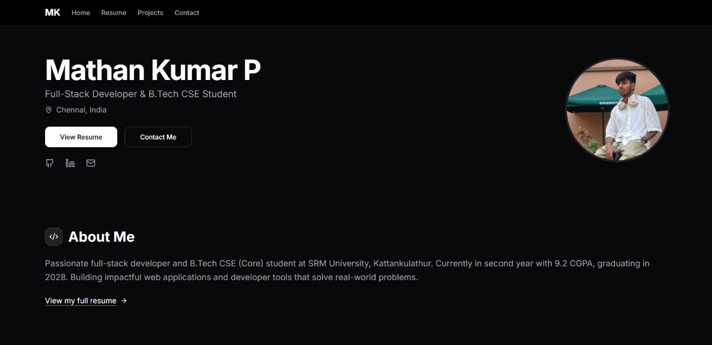

# Developer Portfolio – Mathan

A sleek, modern personal developer portfolio website built to showcase projects, skills, experience, and contact information. Deployed on *Vercel* and crafted with *Next.js, **Tailwind CSS, and **Shadcn/UI* for a clean and responsive UI.

🌐 [Live Website](https://v0-mathan-dev-portfolio-website-roan.vercel.app/)

---

## 🖼 Screenshot

> Replace screenshot.png with an actual screenshot of your portfolio homepage.

---

## ✨ Features

- 🧑‍💻 Developer Introduction Section
- 🛠 Featured Projects with GitHub + Live Links
- 💼 Skills & Tech Stack
- 📄 Resume Download Button
- 📬 Contact Form (email or third-party integration)
- 🌙 Dark Mode Support (if applicable)
- 🔄 Fully Responsive for all screen sizes

---

## 🛠 Tech Stack

- *Framework*: Next.js
- *Styling*: Tailwind CSS, Shadcn/UI
- *Deployment*: Vercel
- *Icons*: Lucide React / Heroicons
- *Animations*: Framer Motion (if used)
- *Forms*: Resend/Formspree (optional)

---

## 📁 Project Structure
